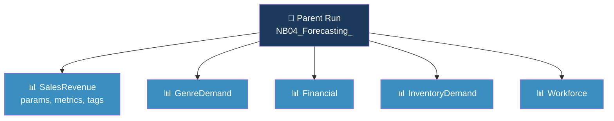

  

<h1 align="center">Forecasting Module</h1>

  <strong>Holt-Winters time-series forecasting with MLflow experiment tracking</strong>

  
  
  
  

  <a href="#-forecast-models">Models</a> •
  <a href="#-mlflow-experiment-tracking">MLflow</a> •
  <a href="#-configuration">Config</a> •
  <a href="#-output-schema">Schema</a> •
  <a href="#-dependencies">Dependencies</a>

---

## 📊 Forecast Models

| # | Model | Target Table | Method | Dimensions |
|---|-------|-------------|--------|------------|
| 1 | Sales Revenue | `ForecastSalesRevenue` | Holt-Winters (additive) | By channel |
| 2 | Genre Demand | `ForecastGenreDemand` | Holt-Winters per genre | By genre |
| 3 | Financial P&L | `ForecastFinancial` | Holt-Winters per account type | By P&L category |
| 4 | Inventory Demand | `ForecastInventoryDemand` | Holt-Winters per book | By book |
| 5 | Workforce | `ForecastWorkforce` | Holt-Winters on headcount/payroll | By metric |

All models project **6 months ahead** with **95% confidence intervals** and require at least **12 months** of history.

---

## 📈 MLflow Experiment Tracking

All forecast runs are tracked in the `HorizonBooks_Forecasting` MLflow experiment:

| Level | Logs |
|-------|------|
| **Parent run** | Global parameters (horizon, confidence, min history) |
| **Child runs** (×5) | Table name, model name, dimensions, row count, MAPE, elapsed time |
| **Aggregation** | Total rows written, tables created, overall elapsed time |

> [!NOTE]
> Fabric's automatic `mlflow.autolog()` is **disabled** to prevent spurious failed experiment runs from statsmodels `.fit()` calls in the try/except fallback loop.

View results: Fabric Portal → **Experiments** → `HorizonBooks_Forecasting`

---

## ⚙️ Configuration

Default parameters (defined in `04_Forecasting.py`, Cell 1):

| Parameter | Default | Description |
|-----------|---------|-------------|
| `FORECAST_HORIZON` | 6 | Months to forecast ahead |
| `CONFIDENCE_LEVEL` | 0.95 | Confidence interval (95%) |
| `MIN_HISTORY_MONTHS` | 12 | Minimum data points required |
| Seasonal periods | 12 | Monthly seasonality cycle |

> `forecast-config.json` documents the same defaults but is not consumed at runtime. The notebook uses Python constants directly for Spark compatibility.

---

## 📋 Output Schema

All tables are written to **GoldLH** under the `analytics` schema.

### Common Columns (all tables)

| Column | Type | Description |
|--------|------|-------------|
| `ForecastMonth` | Date | Projected month (1st of month) |
| `LowerBound` | Double | Lower confidence interval |
| `UpperBound` | Double | Upper confidence interval |
| `ForecastHorizon` | Integer | 0 = actual, 1–6 = forecast |
| `RecordType` | String | `Actual` or `Forecast` |
| `ForecastModel` | String | Algorithm (e.g. `HoltWinters_add_add`) |
| `_generated_at` | Timestamp | Run timestamp |

### Model-Specific Columns

<b>ForecastSalesRevenue</b>

| Column | Type |
|--------|------|
| Channel | String |
| Revenue | Double |
| Orders | Integer |
| Customers | Integer |

**Measures:** Forecast Revenue, Revenue Lower/Upper Bound, Forecast vs Actual Revenue

<b>ForecastGenreDemand</b>

| Column | Type |
|--------|------|
| Genre | String |
| UnitDemand | Double |
| Revenue | Double |

**Measures:** Forecast Unit Demand, Forecast Genre Revenue, Demand Confidence Range

<b>ForecastFinancial</b>

| Column | Type |
|--------|------|
| PLCategory | String |
| Amount | Double |
| TransactionCount | Integer |

**Measures:** Forecast P&L Amount, Forecast P&L Lower, Forecast P&L Upper

<b>ForecastInventoryDemand</b>

| Column | Type |
|--------|------|
| BookID / WarehouseID | String/Integer |
| UnitsDemanded | Double |
| CumulativeDemand | Double |
| StockCoverMonths | Double |

**Measures:** Forecast Demand Units, Stock Coverage Months, Cumulative Forecast Demand

<b>ForecastWorkforce</b>

| Column | Type |
|--------|------|
| Department | String |
| Metric | String |
| Headcount / NetPay | Double |

**Measures:** Forecast Workforce Value, Forecast Payroll, Forecast Headcount, Forecast Openings

---

## 📦 Dependencies

| Package | Version | Purpose |
|---------|---------|---------|
| **statsmodels** | ≥ 0.14 | `ExponentialSmoothing` (Holt-Winters) |
| **pandas** | ≥ 1.5 | Time-series data manipulation |
| **numpy** | ≥ 1.24 | Numerical operations |
| **scipy** | ≥ 1.10 | Statistical functions |
| **mlflow** | built-in | Experiment tracking (Fabric runtime) |

Installed via the **HorizonBooks_SparkEnv** Fabric Spark environment (see `definitions/environment/`).

---

## ▶️ How to Run

The forecast notebook runs as part of the orchestration pipeline (`PL_HorizonBooks_Orchestration`) after Silver→Gold, or can be run **standalone** from the Fabric workspace.

For local exploration, use `ForecastingExploration.ipynb` (standard Jupyter notebook with Holt-Winters visualizations).

---

  Notebook: <code>04_Forecasting.py</code> — Target: <code>GoldLH.analytics.*</code>

