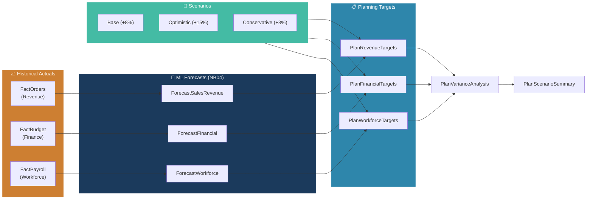

<p align="center">
  
</p>

<h1 align="center">Planning in Fabric IQ Module</h1>

<p align="center">
  <strong>Budget targets, scenario modeling, plan-vs-actual variance, and writeback-ready planning tables</strong>
</p>

<p align="center">
  
  
  
  
</p>

<p align="center">
  <a href="#-planning-models">Models</a> •
  <a href="#-scenario-modeling">Scenarios</a> •
  <a href="#-plan-vs-actual">Variance</a> •
  <a href="#-configuration">Config</a> •
  <a href="#-output-schema">Schema</a> •
  <a href="#-fabric-iq-integration">Fabric IQ</a>
</p>

---

## 📋 Planning Models

| # | Model | Target Table | Method | Dimensions |
|---|-------|-------------|--------|------------|
| 1 | Revenue Targets | `PlanRevenueTargets` | Growth scenario projection | By channel × scenario |
| 2 | Financial Plan | `PlanFinancialTargets` | Budget-based scenario modeling | By account type × cost center × scenario |
| 3 | Workforce Plan | `PlanWorkforceTargets` | Headcount & payroll projection | By department × scenario |
| 4 | Plan vs Actual | `PlanVarianceAnalysis` | Budget variance analysis | By domain × category × month |
| 5 | Scenario Summary | `PlanScenarioSummary` | Cross-domain aggregation | By domain × scenario × quarter |

All planning models project **12 months ahead** with **3 scenarios** and are **writeback-ready** for Fabric SQL.

> [!NOTE]
> This module extends the existing Forecasting pipeline. Forecast outputs from NB04 serve as the statistical baseline for planning targets — Planning in Fabric IQ then enables business users to adjust, approve, and collaborate on these targets interactively.

---

## 📊 Scenario Modeling



| Scenario | Annual Growth | Monthly Rate | Use Case |
|----------|:------------:|:------------:|----------|
| **Base** | +8% | +0.64% | Expected performance, aligned with historical trends |
| **Optimistic** | +15% | +1.17% | Upside scenario — bestseller momentum, market expansion |
| **Conservative** | +3% | +0.25% | Downside scenario — market headwinds, cautious hiring |

---

## 📈 Plan vs Actual

The variance analysis engine classifies budget-to-actual performance using configurable thresholds:

| Status | Revenue Threshold | Expense Logic | Color |
|--------|:-:|:-:|:-:|
| **Favorable** | ≥ +5% above plan | ≥ 5% under budget | 🟢 |
| **On Track** | 0% to +5% | 0% to -5% | 🔵 |
| **Unfavorable** | 0% to -5% | 0% to +5% over budget | 🟠 |
| **Critical** | Below -15% | > 15% over budget | 🔴 |

> Expense items invert the variance logic — underspending is favorable for cost accounts.

---

## ⚙️ Configuration

Default parameters (defined in `planning-config.json`):

| Parameter | Default | Description |
|-----------|---------|-------------|
| `planningHorizon` | 12 | Months to plan ahead |
| `baseFiscalYear` | FY2026 | Starting fiscal year |
| `scenarioTypes` | Base, Optimistic, Conservative | Scenario names |
| `growthAssumptions.base` | 0.08 | 8% annual growth |
| `growthAssumptions.optimistic` | 0.15 | 15% annual growth |
| `growthAssumptions.conservative` | 0.03 | 3% annual growth |
| `varianceThresholds.favorable` | 0.05 | ≥5% is favorable |
| `varianceThresholds.critical` | -0.15 | ≤-15% is critical |

---

## 📋 Output Schema

All tables are written to **GoldLH** under the `planning` schema.

### Common Columns

| Column | Type | Description |
|--------|------|-------------|
| `PlanMonth` | Date | Planning period (1st of month) |
| `Scenario` | String | Base / Optimistic / Conservative |
| `FiscalYear` | String | e.g. FY2026 |
| `FiscalQuarter` | String | Q1–Q4 |
| `PlanHorizon` | Integer | 1–12 (months ahead) |
| `RecordType` | String | Plan / ScenarioSummary |
| `ApprovalStatus` | String | Draft / Submitted / Approved / Rejected |
| `_generated_at` | Timestamp | Run timestamp |

### Model-Specific Columns

<details>
<summary><b>PlanRevenueTargets</b></summary>

| Column | Type |
|--------|------|
| Channel | String |
| TargetRevenue | Decimal |
| LastModifiedBy | String |
| LastModifiedAt | Timestamp |

</details>

<details>
<summary><b>PlanFinancialTargets</b></summary>

| Column | Type |
|--------|------|
| AccountType | String |
| CostCenterID | String |
| PlannedAmount | Decimal |
| LastModifiedBy | String |
| LastModifiedAt | Timestamp |

</details>

<details>
<summary><b>PlanWorkforceTargets</b></summary>

| Column | Type |
|--------|------|
| Department | String |
| PlannedHeadcount | Integer |
| PlannedPayroll | Decimal |
| LastModifiedBy | String |
| LastModifiedAt | Timestamp |

</details>

<details>
<summary><b>PlanVarianceAnalysis</b></summary>

| Column | Type |
|--------|------|
| Domain | String |
| Category | String |
| PlannedAmount | Decimal |
| ActualAmount | Decimal |
| Variance | Decimal |
| VariancePct | Decimal |
| Status | String |

</details>

<details>
<summary><b>PlanScenarioSummary</b></summary>

| Column | Type |
|--------|------|
| Domain | String |
| PlannedTotal | Decimal |

</details>

---

## 🔗 Fabric IQ Integration

Planning in Fabric IQ connects these tables to the broader Fabric platform:

| Capability | How It Works |
|-----------|-------------|
| **Power BI Semantic Models** | Planning tables join the existing Direct Lake model for real-time plan-vs-actual dashboards |
| **Fabric SQL Writeback** | `ApprovalStatus` and target values are writeback-enabled for interactive editing |
| **OneLake Storage** | All planning data lives in OneLake alongside analytical data — no data movement needed |
| **Collaborative Workflows** | Scenario comparison summaries support review/approval processes across teams |
| **AI Context Layer** | Planning targets provide business intent for AI agents (Data Agent can reason about goals vs actuals) |

### SQL Endpoint Views

Three analytics views are provided in `Lakehouse/CreatePlanningTables.sql`:

| View | Description |
|------|-------------|
| `planning.vw_RevenuePlanVsForecast` | Compares revenue targets against ML forecast outputs |
| `planning.vw_FinancialPlanVsBudget` | Aligns financial plan targets with original budget and actuals |
| `planning.vw_WorkforcePlanSummary` | Aggregates workforce plan by department, scenario, and quarter |

---

## ▶️ How to Run

For local exploration, use `PlanningExploration.ipynb` — a standard Jupyter notebook that runs against the sample CSV data and produces scenario visualizations, variance charts, and summary tables.

```bash
cd Planning
jupyter notebook PlanningExploration.ipynb
```

For production deployment in Fabric, the planning tables are created by running `Lakehouse/CreatePlanningTables.sql` on the GoldLH SQL Endpoint, then populated via the planning extension in the orchestration pipeline.

---

## 📚 References

- [Planning in Fabric IQ announcement](https://blog.fabric.microsoft.com/en-us/blog/introducing-planning-in-microsoft-fabric-iq-from-historical-data-to-forecasting-the-future)
- [Microsoft Fabric Planning documentation](https://learn.microsoft.com/fabric/)
- [Fabric Operations billing meters](https://learn.microsoft.com/fabric/enterprise/fabric-operations)

---

<p align="center">
  <sub>Config: <code>planning-config.json</code> — DDL: <code>Lakehouse/CreatePlanningTables.sql</code> — Target: <code>GoldLH.planning.*</code></sub>
</p>
