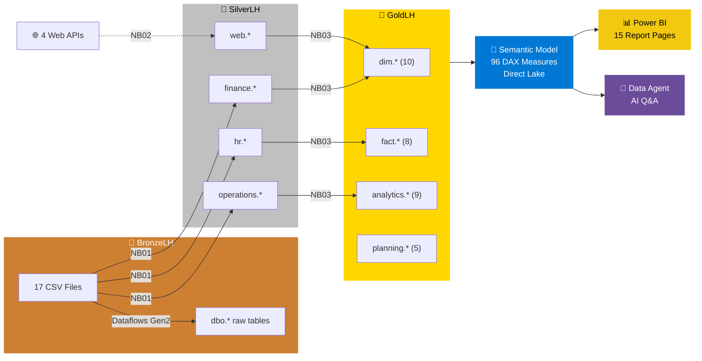
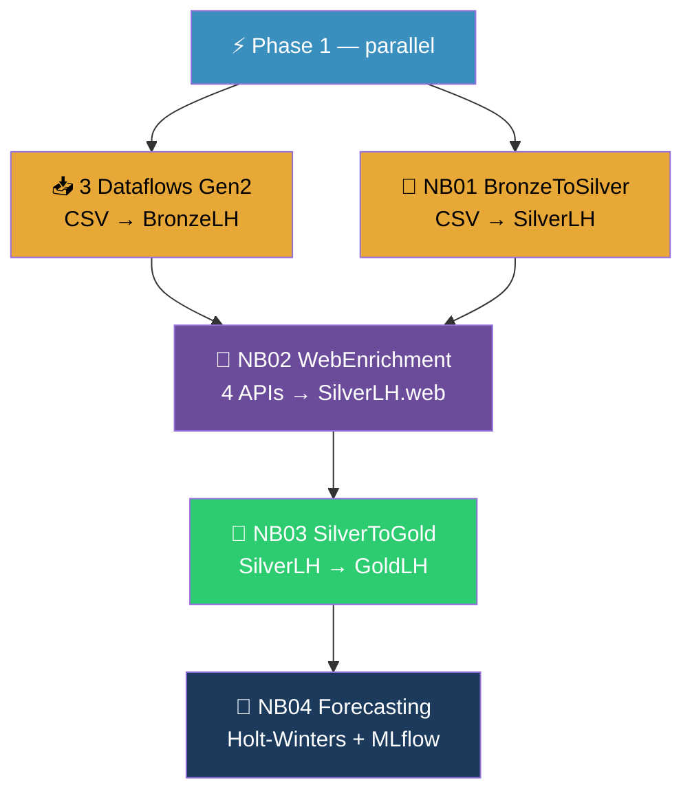

<p align="center">
  
</p>

<p align="center">
  
  
  
  
</p>

<h1 align="center">Horizon Books Publishing & Distribution</h1>

<p align="center">
  <strong>Microsoft Fabric end-to-end demo — medallion lakehouse, semantic model, Power BI reports, AI data agent — deployed in one command.</strong>
</p>

<p align="center">
  
  
  
  
  
  
</p>

<p align="center">
  <a href="#-quick-start">Quick Start</a> •
  <a href="#-key-features">Features</a> •
  <a href="#-architecture">Architecture</a> •
  <a href="#-deployment-options">Deployment</a> •
  <a href="#-demo-scenarios">Demo Scenarios</a> •
  <a href="#-documentation">Docs</a>
</p>

---

## ⚡ Quick Start

```powershell
# That's it. One command.
Connect-AzAccount
.\deploy\Deploy-Full.ps1 -WorkspaceId "<your-workspace-guid>"
```

> [!TIP]
> The script provisions 3 Lakehouses, uploads sample data, runs the full pipeline, deploys the semantic model, 2 Power BI reports, and an AI Data Agent — all in **~15 minutes**.

<details>
<summary><b>📦 Prerequisites</b></summary>

- Microsoft Fabric Capacity (F64 or Trial)
- PowerShell 5.1+
- `Az` module: `Install-Module Az -Scope CurrentUser`
- Logged in: `Connect-AzAccount`

</details>

---

## 🎯 Key Features

<table>
<tr>
<td width="50%">

### 🏗️ Medallion Architecture
**3 schema-enabled Lakehouses** with clear data layers:
- **Bronze** — Raw CSV ingestion (17 files)
- **Silver** — Cleaned, typed, deduplicated (21 tables)
- **Gold** — Star schema (10 dims + 8 facts + 5 forecasts + 4 analytics)

</td>
<td width="50%">

### 📊 96 DAX Measures
Comprehensive semantic model with **Direct Lake** mode:
Finance (P&L, budget, YoY growth), Operations (orders, inventory, returns, fulfillment), HR (workforce, compensation, recruitment), Geographic, and Forecasting

</td>
</tr>
<tr>
<td>

### 🌐 Web Data Enrichment
4 live API integrations with **static fallbacks**:
Exchange rates (frankfurter.app), holidays (date.nager.at), country indicators (restcountries.com), book metadata (openlibrary.org)

</td>
<td>

### 🔮 Holt-Winters Forecasting
5 forecast models with **MLflow experiment tracking**:
Sales revenue by channel, genre demand, financial P&L, inventory demand, workforce planning — 6-month horizon, 95% confidence intervals

</td>
</tr>
<tr>
<td>

### 📋 Planning in Fabric IQ
5 planning models with **scenario modeling** and **writeback**:
Revenue targets, financial plan, workforce plan, plan-vs-actual variance, executive scenario comparison — 12-month horizon, 3 scenarios (Base/Optimistic/Conservative)

</td>
<td>

### 🤖 AI Data Agent
Natural language Q&A over the semantic model:
*"What's our total revenue?"* • *"Any inventory alerts?"* • *"Compare FY2024 vs FY2025"* — self-serve analytics for business users

</td>
<td>

### 🚀 One-Command Deploy
Fully automated PowerShell deployment:
Workspace creation, CSV upload, pipeline orchestration, PBIP deployment, Data Agent provisioning, post-deploy validation — **idempotent** and **resumable**

</td>
</tr>
</table>

> [!NOTE]
> All data is **fictional** — 45 book titles, 30 authors, 50 customers across 20+ countries, 50 employees spanning FY2024–FY2026.

---

## 📋 The Story

Horizon Books is a mid-size publisher with 6 imprints, operating from New York (HQ) and Chicago (warehouse), with international sales operations in London, Tokyo, Frankfurt, and Mexico City. The company serves 50 customers across 20+ countries globally.

FY2024's flagship title *"Winter's Promise"* by Catherine Harper drove record Q4 sales, and the momentum continued into FY2025–FY2026 with new releases like *"Starfall Legacy"* and *"The Data Detective"*. The company publishes across Fiction (Literary, Sci-Fi, Fantasy, Mystery, Thriller, Romance) and Non-Fiction (Tech, Lifestyle, Health, Education).

| Domain | Description | Key Data |
|--------|-------------|----------|
| 💰 **Finance** | P&L, Budget vs Actual, GL Transactions | Revenue, COGS, Royalties, Marketing, OpEx |
| 👥 **HR** | Workforce, Compensation, Recruitment | 50 employees, 7 departments, payroll, reviews |
| 📦 **Operations** | Books, Orders, Inventory, Returns, Geography | 45 titles, 30 authors, 50 customers, 548 orders |

---

## 🏗️ Architecture



### Medallion Lakehouse Layout

| Lakehouse | Layer | Schemas | Contents |
|-----------|-------|---------|----------|
| **BronzeLH** | 🥉 Bronze | `dbo` (default) | 17 CSV files in `Files/`, 17 Delta tables via Dataflow Gen2 |
| **SilverLH** | 🥈 Silver | `finance`, `hr`, `operations`, `web` | Cleaned/typed/deduped Delta tables, web API enrichment |
| **GoldLH** | 🥇 Gold | `dim`, `fact`, `analytics`, `planning` | Star schema dimensions & facts, advanced analytics tables, planning targets |

All 3 Lakehouses use **schema-enabled** mode (`lakehouse.schema.table` naming). The Semantic Model binds via `schemaName` in TMDL partitions for Direct Lake.

---

## 🔧 Notebook Pipeline



| Notebook | Default LH | Source | Target | Key Operations |
|----------|-----------|--------|--------|----------------|
| **01_BronzeToSilver** | BronzeLH | 17 CSV files | SilverLH (`finance`/`hr`/`operations`) | Schema enforcement, data quality, dedup, audit columns |
| **02_WebEnrichment** | SilverLH | 4 public APIs | SilverLH.`web.*` | Exchange rates, holidays, country data, book metadata. **Static fallbacks** for all APIs |
| **03_SilverToGold** | GoldLH | SilverLH tables | GoldLH (`dim`/`fact`/`analytics`) | DimDate, RFM, cohort, anomaly detection, co-purchasing, EMA forecast. **Safety net** creates empty stubs |
| **04_Forecasting** | GoldLH | GoldLH fact tables | GoldLH (`analytics`) | Holt-Winters: 5 models, 6-month horizon, 95% CI. **MLflow** parent/child runs |
| **05_DiagnosticCheck** | GoldLH | All 3 Lakehouses | — (read-only) | Post-deploy validation: verifies all 23 Gold + 17 Silver + Bronze CSV files |

<details>
<summary><b>🌐 Web APIs used</b> (click to expand)</summary>

| API | Data | Fallback |
|-----|------|----------|
| **frankfurter.app** | Monthly exchange rates (16 currencies, FY2024–FY2026) | Static rates |
| **date.nager.at** | Public holidays for 29 countries (2024–2026) | Empty data |
| **restcountries.com** | Country indicators (population, area, Gini, languages) | Built-in dataset (28 countries) |
| **openlibrary.org** | Book metadata by ISBN (subjects, covers, publisher) | Graceful skip |

All APIs are free and require no authentication.

</details>

<details>
<summary><b>📈 Advanced Analytics tables in Gold</b> (click to expand)</summary>

| Table | Description |
|-------|-------------|
| `GoldCohortAnalysis` | Customer retention matrix by first-purchase cohort |
| `GoldRevenueAnomalies` | Daily revenue anomaly flags (30-day rolling Z-score) |
| `GoldBookCoPurchase` | Book pair affinities with Support, Confidence, and Lift |
| `GoldRevenueForecast` | Channel revenue projection using weighted moving averages |

</details>

---

## 🚀 Deployment Options

### Option A: One-Command Deployment *(Recommended — ~15 min)*

```powershell
Connect-AzAccount
.\deploy\Deploy-Full.ps1 -WorkspaceId "<your-workspace-guid>"
```

<details>
<summary><b>📋 What it does (11 automated steps)</b></summary>

| Step | Action | Time |
|------|--------|------|
| 1 | Create 3 Lakehouses (BronzeLH, SilverLH, GoldLH) with schemas | ~3 min |
| 2 | Upload 17 CSV files to BronzeLH via OneLake DFS API | ~1 min |
| 3 | Deploy Spark Environment + 4 PySpark notebooks | ~1 min |
| 4 | Run NB01 Bronze→Silver | ~3 min |
| 5 | Deploy 3 Dataflow Gen2 items + orchestration pipeline | ~1 min |
| 6 | **Run pipeline**: DF + NB01 → NB02 → NB03 → NB04 | ~7 min |
| 7 | Execute SQL scripts (CreateTables + GenerateDateDimension) | ~1 min |
| 8 | Deploy Semantic Model (Direct Lake, 96 measures) | ~1 min |
| 9 | Deploy 2 Reports: Analytics (10 pages) + Forecasting (5 pages) | <1 min |
| 10 | Deploy Data Agent (F64+ only) | <1 min |
| 11 | Validate all deployed items | <1 min |

</details>

```powershell
# Optional flags
.\deploy\Deploy-Full.ps1 -WorkspaceId "<guid>" -SkipPipelineRun   # Don't run pipeline
.\deploy\Deploy-Full.ps1 -WorkspaceId "<guid>" -SkipDataAgent      # Skip AI Agent
.\deploy\Deploy-Full.ps1 -WorkspaceId "<guid>" -SkipValidation     # Skip validation
```

### Option B: Step-by-Step Scripts

<details>
<summary><b>🔧 Individual deployment commands</b></summary>

```powershell
Connect-AzAccount

# (Optional) Create workspace with logo
.\deploy\New-HorizonBooksWorkspace.ps1 -CapacityId "<capacity-guid>"

# Deploy components individually
.\deploy\Deploy-Full.ps1      -WorkspaceId "<guid>" -SkipPipelineRun
.\deploy\Deploy-Pipeline.ps1  -WorkspaceId "<guid>"   # Dataflows + Pipeline
.\deploy\Deploy-PowerBI.ps1   -WorkspaceId "<guid>"   # Semantic Model + 2 Reports
.\deploy\Deploy-DataAgent.ps1 -WorkspaceId "<guid>"   # Data Agent
.\deploy\Upload-SampleData.ps1 -WorkspaceId "<guid>" -BronzeLakehouseId "<bronze-lh-guid>"
.\deploy\Validate-Deployment.ps1 -WorkspaceId "<guid>"
```

</details>

### Option C: PBIP in Power BI Desktop

<details>
<summary><b>📊 Open locally for editing</b></summary>

1. Open `HorizonBooksAnalytics/HorizonBooksAnalytics.pbip` in Power BI Desktop (10-page Analytics report)
2. Open `HorizonBooksForecasting/HorizonBooksForecasting.pbip` for the Forecasting report (5 pages)
3. Replace tokens in `expressions.tmdl`:
   - `{{SQL_ENDPOINT}}` → your GoldLH SQL endpoint
   - `{{LAKEHOUSE_NAME}}` → your Gold Lakehouse name (e.g. `GoldLH`)
4. Connect and refresh to validate the model

</details>

### Option D: Manual Setup (~90 min)

<details>
<summary><b>🛠️ Full hands-on walkthrough</b></summary>

#### Step 1: Create Lakehouses (5 min)
Create `BronzeLH`, `SilverLH`, `GoldLH` with **schema-enabled** mode.

#### Step 2: Upload Sample Data (5 min)
Upload all 17 CSVs from `SampleData/` into `BronzeLH/Files/` (flat structure):

```
Files/DimAccounts.csv, DimAuthors.csv, DimBooks.csv, DimCostCenters.csv,
DimCustomers.csv, DimDepartments.csv, DimEmployees.csv, DimGeography.csv,
DimWarehouses.csv, FactBudget.csv, FactFinancialTransactions.csv,
FactInventory.csv, FactOrders.csv, FactPayroll.csv, FactPerformanceReviews.csv,
FactRecruitment.csv, FactReturns.csv
```

#### Step 3: Create Dataflows Gen2 (15 min)
Follow [Dataflows/DataflowConfiguration.md](Dataflows/DataflowConfiguration.md).

#### Step 4: Run SQL Scripts (5 min)
Execute `Lakehouse/GenerateDateDimension.sql`, `Lakehouse/CreateTables.sql`, `Lakehouse/CreateViews.sql`.

#### Step 5: Create Semantic Model (20 min)
Follow [SemanticModel/SemanticModelDefinition.md](SemanticModel/SemanticModelDefinition.md) — 27 relationships, 96 DAX measures.

#### Step 6: Build Reports (40 min)
Follow [Reports/ReportSpecification.md](Reports/ReportSpecification.md) — Analytics (10 pages) + Forecasting (5 pages).

#### Step 7: Create Data Agent (10 min)
Follow [DataAgent/DataAgentConfiguration.md](DataAgent/DataAgentConfiguration.md).

</details>

### ⏱️ Time Comparison

| Approach | Time | What You Get |
|----------|------|--------------|
| **One-Command (A)** | **~15 min** | Everything: provision + pipeline + model + validate |
| Step-by-Step (B) | ~15 min | Individual scripts for finer control |
| PBIP Desktop (C) | ~10 min | Local model editing + publish |
| Manual (D) | ~90 min | Full hands-on walkthrough |

---

## 🎯 Demo Scenarios

<table>
<tr>
<td width="50%">

### 📊 Scenario 1: Executive Briefing (5 min)
Executive Dashboard → Q4 surge → Winter's Promise deep dive → budget overperformance → headcount growth → FY2024 vs FY2025 trends

### 💰 Scenario 2: Finance Deep Dive (10 min)
P&L waterfall → Budget vs Actual → Cost analysis → Revenue by channel → Royalties impact

### 📦 Scenario 3: Operations Review (10 min)
Book ranking → Customer segmentation → Channel analysis → Inventory health → Returns → Fulfillment

</td>
<td width="50%">

### 👥 Scenario 4: HR Analytics (10 min)
Workforce overview → Department distribution → Compensation analysis → Performance → Recruitment pipeline → Revenue per employee

### 🤖 Scenario 5: AI-Powered Insights (5 min)
Open Data Agent → *"Total revenue FY2024–FY2026?"* → *"Inventory alerts?"* → *"Compare FY2024 vs FY2025"* → self-serve analytics

### 🔮 Scenario 6: Forecasting (5 min)
Sales revenue forecast → Genre demand → Financial P&L projections → Inventory planning → Workforce planning

### 📋 Scenario 7: Planning in Fabric IQ (10 min)
Revenue targets by channel → Scenario comparison (Base/Optimistic/Conservative) → Financial plan vs budget alignment → Workforce headcount targets → Plan vs actual variance dashboard → Executive scenario summary

</td>
</tr>
</table>

---

## 📊 Key Demo Talking Points

<details>
<summary><b>💰 Finance Story</b></summary>

- **Total Revenue (FY2024–FY2026):** ~$3M+ across all channels (growing ~8–10% YoY)
- **Holiday Impact:** Q4 revenue is 2–3x higher than Q1 due to "Winter's Promise" and seasonal demand
- **Budget Overperformance:** Revenue exceeded budget by ~40–80% in Q4 FY2024
- **Cost Control:** COGS stayed under budget; marketing spend increased for bestsellers
- **Rights Revenue:** Growing foreign rights deals ($90K+ in FY2024) diversify revenue
- **Multi-Year Trends:** FY2025 shows sustained growth; FY2026 H1 data available

</details>

<details>
<summary><b>📦 Operations Story</b></summary>

- **Bestseller:** "Winter's Promise" dominated Q4 FY2024 with 50,000+ print run
- **New Releases:** FY2025 launches include "Starfall Legacy" (Fantasy) and "The Data Detective" (Tech)
- **Channel Mix:** Amazon/online is the largest channel (~40%), growing digital share
- **Order Volume:** 548 orders across FY2024–FY2026 (growing ~8% YoY)
- **Returns:** Industry-typical ~5–8% return rate, mainly overstock (not quality issues)
- **Fulfillment:** 93%+ on-time delivery, avg 3–4 day fulfillment
- **Geographic Reach:** 30+ international customers, 20+ countries (growing EMEA and APAC)

</details>

<details>
<summary><b>👥 HR Story</b></summary>

- **Growing Team:** 50 employees across 7 departments, including international staff
- **Global Presence:** Staff in London, Tokyo, Frankfurt, Mexico City, and remote
- **Growth Mode:** Active recruitment pipeline (40 requisitions, 8 filled in FY2025)
- **Strong Performance:** 60%+ employees rated "Exceeds" or "Outstanding"
- **Competitive Pay:** Average tenure 4+ years suggests good retention
- **Multi-Year Payroll:** 611 payroll records spanning FY2024–FY2026

</details>

---

## 🛡️ Resilience & Observability

<table>
<tr>
<td width="33%">

### 🌐 API Fallbacks (NB02)
Every web API has a static fallback — the pipeline completes even when external services are unavailable.

</td>
<td width="33%">

### 🛡️ Gold Safety Net (NB03)
All 18 semantic-model-required tables are verified after transforms. Missing tables get empty stubs with correct schemas.

</td>
<td width="33%">

### 📈 MLflow Tracking (NB04)
Dedicated `HorizonBooks_Forecasting` experiment with parent/child runs, parameters, metrics (MAPE), and tags per forecast table.

</td>
</tr>
<tr>
<td colspan="3">

### 📋 Planning in Fabric IQ
Extends forecasting with scenario-based planning (Budget targets, Revenue/Financial/Workforce plans, 3 scenarios, plan-vs-actual variance). Writeback-ready tables in `GoldLH.planning.*` connect to Fabric IQ for collaborative budgeting and approval workflows. [Learn more →](Planning/README.md)

</td>
</tr>
</table>

---

## 🗂️ Workspace Organization

Once deployed, the workspace is organized into **folders** and a **visual task flow**:

| Folder | Contents |
|--------|----------|
| **01 - Data Storage** | BronzeLH, SilverLH, GoldLH (+ SQL Endpoints) |
| **02 - Data Ingestion** | *(Reserved for future connectors)* |
| **03 - Data Transformation** | NB01–NB05, HorizonBooks_SparkEnv |
| **04 - Orchestration** | HorizonBooks Data Pipeline |
| **05 - Analytics** | HorizonBooksModel, Analytics Report (10 pages), Forecasting Report (5 pages) |

```
[Orchestrate] → [Ingest CSV Data] → [Stage Raw Data] → [Bronze→Silver]
                                                            ↓
 [Visualize & Analyze] ← [Store Gold] ← [Silver→Gold] ← [Enrich Web Data]
```

Import `deploy/HorizonBooks_TaskFlow.json` into the Fabric workspace task flow area.

---

## 🏗️ Project Structure

<details>
<summary><b>📁 Full project tree</b> (click to expand)</summary>

```
FullDemoFabricBookUseCase/
│
├── README.md                          ← This file
├── assets/
│   ├── workspace-logo.svg             ← Workspace logo (SVG source)
│   └── workspace-logo.png             ← Workspace logo (PNG, uploaded to Fabric)
│
├── deploy/                            ← PowerShell Deployment Scripts
│   ├── HorizonBooks.psm1              ← Shared helper module
│   ├── Deploy-Full.ps1                ← ONE-COMMAND deployment
│   ├── New-HorizonBooksWorkspace.ps1  ← Workspace + capacity + logo
│   ├── Deploy-Pipeline.ps1            ← Dataflows + Pipeline
│   ├── Deploy-PowerBI.ps1             ← Semantic Model + 2 Reports (idempotent)
│   ├── Deploy-DataAgent.ps1           ← Data Agent creation
│   ├── Deploy-Diagnostic.ps1          ← Diagnostic notebook
│   ├── Deploy-Planning.ps1            ← Planning tables & scenario data
│   ├── Validate-Deployment.ps1        ← Post-deploy validation
│   ├── Upload-SampleData.ps1          ← CSV upload to BronzeLH
│   ├── Redeploy-Notebooks.ps1         ← Re-deploy notebooks only
│   ├── Verify-GoldTables.ps1          ← Gold table verification
│   └── *_TaskFlow.json (×9)           ← Fabric task flow definitions
│
├── notebooks/                         ← PySpark Transformation Notebooks
│   ├── 01_BronzeToSilver.py
│   ├── 02_WebEnrichment.py
│   ├── 03_SilverToGold.py
│   ├── 04_Forecasting.py
│   └── 05_DiagnosticCheck.py
│
├── HorizonBooksAnalytics/             ← Power BI Project (PBIP)
│   ├── HorizonBooksAnalytics.pbip
│   ├── HorizonBooksAnalytics.SemanticModel/
│   │   └── definition/
│   │       ├── model.tmdl             ← Tables, relationships, culture
│   │       ├── expressions.tmdl       ← Direct Lake shared expression
│   │       ├── relationships.tmdl     ← 27 relationships
│   │       └── tables/ (23 .tmdl)     ← Per-table definitions + measures
│   └── HorizonBooksAnalytics.Report/
│       └── definition/
│           ├── report.json            ← Report config + theme
│           └── pages/ (10 sections)   ← Visual definitions
│
├── HorizonBooksForecasting/           ← Forecasting Report (PBIP)
│   └── HorizonBooksForecasting.Report/
│       └── definition/pages/ (5 pages)
│
├── SampleData/                        ← 17 CSV files
│   ├── Finance/ (4 files)             ← DimAccounts, DimCostCenters, FactFinancialTransactions, FactBudget
│   ├── HR/ (5 files)                  ← DimEmployees, DimDepartments, FactPayroll, FactPerformanceReviews, FactRecruitment
│   └── Operations/ (8 files)          ← DimBooks, DimAuthors, DimCustomers, DimGeography, DimWarehouses, FactOrders, FactInventory, FactReturns
│
├── Lakehouse/                         ← SQL Scripts
│   ├── CreateTables.sql
│   ├── CreateViews.sql                ← 8 analytics views
│   ├── CreatePlanningTables.sql       ← Planning schema + 5 tables + 3 views
│   └── GenerateDateDimension.sql
│
├── Forecasting/                       ← Forecast model docs
│   ├── README.md
│   ├── forecast-config.json
│   └── ForecastingExploration.ipynb   ← Local Jupyter notebook
│
├── Planning/                          ← Planning in Fabric IQ extension
│   ├── README.md
│   ├── planning-config.json
│   └── PlanningExploration.ipynb      ← Local Jupyter notebook (scenarios, variance)
│
├── definitions/                       ← CI/CD Item Definitions
│   ├── items-manifest.json            ← 15 Fabric items
│   ├── dataflows/ (3 domains)         ← Mashup.pq + destinations
│   ├── environment/                   ← Spark runtime config
│   ├── lakehouses/ (3 configs)
│   ├── notebooks/ (4 metadata)
│   ├── pipeline/                      ← Orchestration definition
│   └── report/                        ← Report deployment config
│
├── tests/                             ← Pester Test Suite
│   ├── Deploy-HorizonBooks.Tests.ps1
│   └── Run-Tests.ps1
│
├── SemanticModel/
│   └── SemanticModelDefinition.md     ← 27 relationships, 96 DAX measures, display folders
├── Reports/
│   └── ReportSpecification.md         ← 10-page layout & visual specs
├── DataAgent/
│   └── DataAgentConfiguration.md      ← AI agent instructions & config
└── Dataflows/
    └── DataflowConfiguration.md       ← Per-column transformation details
```

</details>

---

## 🧰 Deploy Scripts Reference

| Script | Description |
|--------|-------------|
| `Deploy-Full.ps1` | One-command full deployment (recommended) |
| `New-HorizonBooksWorkspace.ps1` | Workspace creation + capacity + logo |
| `HorizonBooks.psm1` | Shared module (tokens, API helpers, logging) |
| `Deploy-Pipeline.ps1` | Dataflows Gen2 (with destinations) + Pipeline |
| `Deploy-PowerBI.ps1` | Semantic Model + 2 Reports (idempotent) |
| `Deploy-DataAgent.ps1` | Data Agent creation (F64+ only) |
| `Deploy-Diagnostic.ps1` | Diagnostic notebook deployment |
| `Deploy-Planning.ps1` | Planning tables & scenario data (Fabric IQ) |
| `Validate-Deployment.ps1` | Post-deploy validation checker |
| `Upload-SampleData.ps1` | Standalone CSV upload to BronzeLH |
| `Redeploy-Notebooks.ps1` | Re-deploy notebooks without full redeploy |
| `Verify-GoldTables.ps1` | Post-deploy Gold table verification |
| `Update-DataflowDestinations.ps1` | Re-apply Lakehouse destinations |

---

## 🧪 Testing

```powershell
# Run Pester tests
Invoke-Pester .\tests\Deploy-HorizonBooks.Tests.ps1 -Tag "Unit"

# Full test runner
.\tests\Run-Tests.ps1
```

---

## 📚 Documentation

| Document | Description |
|----------|-------------|
| 📐 [Semantic Model Definition](SemanticModel/SemanticModelDefinition.md) | 27 relationships, 96 DAX measures, display folders, RLS |
| 📊 [Report Specification](Reports/ReportSpecification.md) | 10-page layout, visuals, slicers, bookmarks, tooltips |
| 🤖 [Data Agent Configuration](DataAgent/DataAgentConfiguration.md) | AI agent instructions, sample conversations, testing checklist |
| 📥 [Dataflow Configuration](Dataflows/DataflowConfiguration.md) | Per-column type & quality transformations for 3 dataflows |
| 🔮 [Forecasting Module](Forecasting/README.md) | Holt-Winters config, MLflow tracking, output schemas |
| � [Planning Module](Planning/README.md) | Planning in Fabric IQ — scenarios, variance, writeback tables |
| �🔧 [CI/CD Definitions](definitions/README.md) | Token placeholders, item manifest, deployment patterns |

---

## 📝 Data Notes

<details>
<summary><b>📊 Data type & format notes</b> (click to expand)</summary>

| Column | File(s) | Format | Notes |
|--------|---------|--------|-------|
| `FiscalYear` | FactFinancialTransactions, FactBudget | `FY2024`–`FY2026` | "FY" prefix — `type text`, not integer |
| `FiscalMonth` | FactFinancialTransactions, FactBudget | numeric | `Int64.Type` (1–12) |
| `PerformanceRating` | FactPerformanceReviews | `Exceeds Expectations` | Categorical text label |
| `TimeToFillDays` | FactRecruitment | integer or blank | Nullable for open requisitions |
| `AccountID` | DimAccounts, FactFinancialTransactions | integer | `Int64.Type`, not text |
| `ParentAccountID` | DimAccounts | integer or blank | Nullable for root accounts |

</details>

<details>
<summary><b>🔄 Dataflow destination architecture</b> (click to expand)</summary>

Dataflow Gen2 destinations are configured programmatically via the Fabric REST API:

1. **Global parameters** (`TargetWorkspaceId`, `TargetLakehouseId`) with `{{WORKSPACE_ID}}`/`{{BRONZE_LH_ID}}` placeholders
2. **`_Target` navigation queries** using `Lakehouse.Contents()` pointing to BronzeLH tables
3. **`[DataDestinations]` attributes** linking source queries to `_Target` queries
4. **`queryMetadata.json`** marks `_Target` and parameter queries as `isHidden = true`

To re-apply destinations after portal edits:
```powershell
.\deploy\Update-DataflowDestinations.ps1 -WorkspaceId "<your-workspace-guid>"
```

</details>

<details>
<summary><b>🧹 Data quality transformations</b> (click to expand)</summary>

- **Text:** `Text.Trim` + `Text.Proper` for names, `Text.Lower` for emails, `Text.Upper` for currencies
- **Numeric:** Non-negative clamping, null → 0 defaults, `Number.Abs` for refunds
- **Range:** RoyaltyRate/Discount/Utilization normalized to 0–1 (values > 1 ÷ 100)
- **Score:** OverallScore clamped to 0–100
- **Geo:** Latitude [-90, 90], Longitude [-180, 180] validation
- **Defaults:** Missing budget amounts → 0, empty descriptions → `""`, uncategorized → `"Uncategorized"`

See [Dataflows/DataflowConfiguration.md](Dataflows/DataflowConfiguration.md) for per-column details.

</details>

---

<p align="center">
  <sub>Built with ❤️ for the Microsoft Fabric community</sub><br/>
  <sub>All data is fictional and created for demo purposes</sub>
</p>
